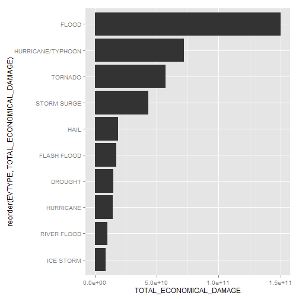

# The Most Harmful Weather Events Across the United States

## Synopsis

Storms and other severe weather events can cause both public health and economic problems for communities and municipalities. Many severe events can result in fatalities, injuries, and property damage, and preventing such outcomes to the extent possible is a key concern.
The basic goal of this investigation is to explore the NOAA Storm Database and answer some basic questions about severe weather events:
* Across the United States, which types of events are most harmful with respect to population health?
* Across the United States, which types of events have the greatest economic consequences?

## Data Processing

### Data set

The U.S. National Oceanic and Atmospheric Administration's (NOAA) storm database is used for investigation. This database tracks characteristics of major storms and weather events in the United States, including when and where they occur, as well as estimates of any fatalities, injuries, and property damage. The data is downloaded in the form of a comma-separated-value file compressed via the bzip2 algorithm from [source](https://d396qusza40orc.cloudfront.net/repdata%2Fdata%2FStormData.csv.bz2).
There is also some documentation of the database available:
* [National Weather Service Storm Data Documentation](https://d396qusza40orc.cloudfront.net/repdata%2Fpeer2_doc%2Fpd01016005curr.pdf)
* [National Climatic Data Center Storm Events FAQ](https://d396qusza40orc.cloudfront.net/repdata%2Fpeer2_doc%2FNCDC%20Storm%20Events-FAQ%20Page.pdf)
The events in the database start in the year 1950 and end in November 2011. In the earlier years of the database there are generally fewer events recorded, most likely due to a lack of good records. More recent years should be considered more complete.

### Data download

As mentioned before, data is downloaded from [source](https://d396qusza40orc.cloudfront.net/repdata%2Fdata%2FStormData.csv.bz2) and placed in 'data/' directory. 'dplyr' package is used immediatelly for data processing.


```r
if (!file.exists("data")) {
	dir.create("data")
}
download.file("https://d396qusza40orc.cloudfront.net/repdata%2Fdata%2FStormData.csv.bz2", dest = "data/storm_data.csv.bz2")

library(dplyr)
data <- tbl_df(read.csv("data/storm_data.csv.bz2"))
```

Let's verify data that was downloaded:

```r
data
```

```
## Source: local data frame [902,297 x 37]
## 
##    STATE__           BGN_DATE BGN_TIME TIME_ZONE COUNTY COUNTYNAME STATE
## 1        1  4/18/1950 0:00:00     0130       CST     97     MOBILE    AL
## 2        1  4/18/1950 0:00:00     0145       CST      3    BALDWIN    AL
## 3        1  2/20/1951 0:00:00     1600       CST     57    FAYETTE    AL
## 4        1   6/8/1951 0:00:00     0900       CST     89    MADISON    AL
## 5        1 11/15/1951 0:00:00     1500       CST     43    CULLMAN    AL
## 6        1 11/15/1951 0:00:00     2000       CST     77 LAUDERDALE    AL
## 7        1 11/16/1951 0:00:00     0100       CST      9     BLOUNT    AL
## 8        1  1/22/1952 0:00:00     0900       CST    123 TALLAPOOSA    AL
## 9        1  2/13/1952 0:00:00     2000       CST    125 TUSCALOOSA    AL
## 10       1  2/13/1952 0:00:00     2000       CST     57    FAYETTE    AL
## ..     ...                ...      ...       ...    ...        ...   ...
## Variables not shown: EVTYPE (fctr), BGN_RANGE (dbl), BGN_AZI (fctr),
##   BGN_LOCATI (fctr), END_DATE (fctr), END_TIME (fctr), COUNTY_END (dbl),
##   COUNTYENDN (lgl), END_RANGE (dbl), END_AZI (fctr), END_LOCATI (fctr),
##   LENGTH (dbl), WIDTH (dbl), F (int), MAG (dbl), FATALITIES (dbl),
##   INJURIES (dbl), PROPDMG (dbl), PROPDMGEXP (fctr), CROPDMG (dbl),
##   CROPDMGEXP (fctr), WFO (fctr), STATEOFFIC (fctr), ZONENAMES (fctr),
##   LATITUDE (dbl), LONGITUDE (dbl), LATITUDE_E (dbl), LONGITUDE_ (dbl),
##   REMARKS (fctr), REFNUM (dbl)
```


```r
data <- mutate(data, EVTYPE = toupper(EVTYPE))

data <- mutate(data, 
	PROPERTY_DAMAGE = PROPDMG * ifelse(PROPDMGEXP == 'B', 1000000000, ifelse(PROPDMGEXP == 'M', 1000000, ifelse(PROPDMGEXP == 'K', 1000, 1))), 
	CROP_DAMAGE = CROPDMG * ifelse(CROPDMGEXP == 'B', 1000000000, ifelse(CROPDMGEXP == 'M', 1000000, ifelse(CROPDMGEXP == 'K', 1000, 1)))
)

data_per_type <- summarise(group_by(data, EVTYPE), 
	TOTAL_FATALITIES = sum(FATALITIES), 
	TOTAL_INJURIES = sum(INJURIES),
	TOTAL_PROPERTY_DAMAGE = sum(PROPERTY_DAMAGE),
	TOTAL_CROP_DAMAGE = sum(CROP_DAMAGE)
)

data_per_type <- mutate(data_per_type,
	TOTAL_POPULATION_DAMAGE = TOTAL_FATALITIES + TOTAL_INJURIES,
	TOTAL_ECONOMICAL_DAMAGE = TOTAL_PROPERTY_DAMAGE + TOTAL_CROP_DAMAGE
)
```

## Results


```r
ggplot(
	slice(arrange(data_per_type, desc(TOTAL_FATALITIES)), 1:10), 
	aes(x = reorder(EVTYPE, TOTAL_FATALITIES), y = TOTAL_FATALITIES)
) + 
geom_bar(stat="identity") + 
coord_flip()
```

 

```r
ggplot(
	slice(arrange(data_per_type, desc(TOTAL_INJURIES)), 1:10), 
	aes(x = reorder(EVTYPE, TOTAL_INJURIES), y = TOTAL_INJURIES)
) + 
geom_bar(stat="identity") + 
coord_flip()
```

 

```r
ggplot(
	slice(arrange(data_per_type, desc(TOTAL_ECONOMICAL_DAMAGE)), 1:10), 
	aes(x = reorder(EVTYPE, TOTAL_ECONOMICAL_DAMAGE), y = TOTAL_ECONOMICAL_DAMAGE)
) + 
geom_bar(stat="identity") + 
coord_flip()
```

 
