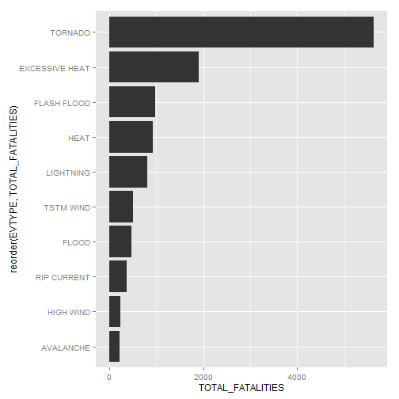
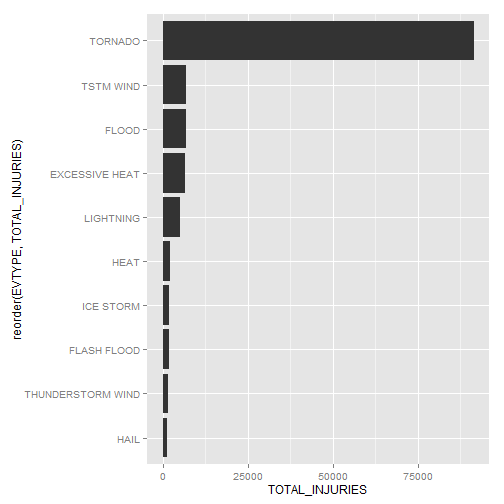
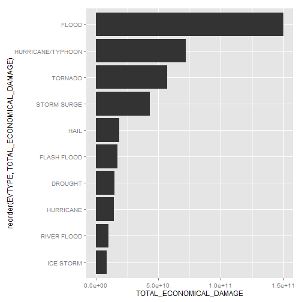

## Synopsis

## Data Processing


```r
if (!file.exists("data")) {
	dir.create("data")
}
download.file("https://d396qusza40orc.cloudfront.net/repdata%2Fdata%2FStormData.csv.bz2", dest = "data/storm_data.csv.bz2")

library(dplyr)
data <- tbl_df(read.csv("data/storm_data.csv.bz2"))

data <- mutate(data, EVTYPE = toupper(EVTYPE))

data <- mutate(data, 
	PROPERTY_DAMAGE = PROPDMG * ifelse(PROPDMGEXP == 'B', 1000000000, ifelse(PROPDMGEXP == 'M', 1000000, ifelse(PROPDMGEXP == 'K', 1000, 1))), 
	CROP_DAMAGE = CROPDMG * ifelse(CROPDMGEXP == 'B', 1000000000, ifelse(CROPDMGEXP == 'M', 1000000, ifelse(CROPDMGEXP == 'K', 1000, 1)))
)

data_per_type <- summarise(group_by(data, EVTYPE), 
	TOTAL_FATALITIES = sum(FATALITIES), 
	TOTAL_INJURIES = sum(INJURIES),
	TOTAL_PROPERTY_DAMAGE = sum(PROPERTY_DAMAGE),
	TOTAL_CROP_DAMAGE = sum(CROP_DAMAGE)
)

data_per_type <- mutate(data_per_type,
	TOTAL_POPULATION_DAMAGE = TOTAL_FATALITIES + TOTAL_INJURIES,
	TOTAL_ECONOMICAL_DAMAGE = TOTAL_PROPERTY_DAMAGE + TOTAL_CROP_DAMAGE
)
```

## Results


```r
ggplot(
	slice(arrange(data_per_type, desc(TOTAL_FATALITIES)), 1:10), 
	aes(x = reorder(EVTYPE, TOTAL_FATALITIES), y = TOTAL_FATALITIES)
) + 
geom_bar(stat="identity") + 
coord_flip()
```

 

```r
ggplot(
	slice(arrange(data_per_type, desc(TOTAL_INJURIES)), 1:10), 
	aes(x = reorder(EVTYPE, TOTAL_INJURIES), y = TOTAL_INJURIES)
) + 
geom_bar(stat="identity") + 
coord_flip()
```

 

```r
ggplot(
	slice(arrange(data_per_type, desc(TOTAL_ECONOMICAL_DAMAGE)), 1:10), 
	aes(x = reorder(EVTYPE, TOTAL_ECONOMICAL_DAMAGE), y = TOTAL_ECONOMICAL_DAMAGE)
) + 
geom_bar(stat="identity") + 
coord_flip()
```

 
