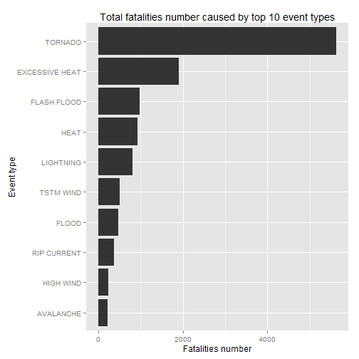

# The Most Harmful Weather Events Across the United States

## Synopsis

Storms and other severe weather events can cause both public health and economic problems for communities and municipalities. Many severe events can result in fatalities, injuries, and property damage, and preventing such outcomes to the extent possible is a key concern.
The basic goal of this investigation is to explore the NOAA Storm Database and answer some basic questions about severe weather events:
* Across the United States, which types of events are most harmful with respect to population health?
* Across the United States, which types of events have the greatest economic consequences?

## Data Processing

### Data set

The U.S. National Oceanic and Atmospheric Administration's (NOAA) storm database is used for investigation. This database tracks characteristics of major storms and weather events in the United States, including when and where they occur, as well as estimates of any fatalities, injuries, and property damage. The data is downloaded in the form of a comma-separated-value file compressed via the bzip2 algorithm from [source](https://d396qusza40orc.cloudfront.net/repdata%2Fdata%2FStormData.csv.bz2).
There is also some documentation of the database available:
* [National Weather Service Storm Data Documentation](https://d396qusza40orc.cloudfront.net/repdata%2Fpeer2_doc%2Fpd01016005curr.pdf)
* [National Climatic Data Center Storm Events FAQ](https://d396qusza40orc.cloudfront.net/repdata%2Fpeer2_doc%2FNCDC%20Storm%20Events-FAQ%20Page.pdf)
The events in the database start in the year 1950 and end in November 2011. In the earlier years of the database there are generally fewer events recorded, most likely due to a lack of good records. More recent years should be considered more complete.

### Data download

As mentioned before, data is downloaded from [source](https://d396qusza40orc.cloudfront.net/repdata%2Fdata%2FStormData.csv.bz2) and placed in 'data/' directory. 'dplyr' package is used immediatelly for data processing.


```r
if (!file.exists("data")) {
	dir.create("data")
}
download.file("https://d396qusza40orc.cloudfront.net/repdata%2Fdata%2FStormData.csv.bz2", dest = "data/storm_data.csv.bz2")

library(dplyr)
data <- tbl_df(read.csv("data/storm_data.csv.bz2"))
```

Let's verify data that was downloaded:

```r
data
```

```
## Source: local data frame [902,297 x 37]
## 
##    STATE__           BGN_DATE BGN_TIME TIME_ZONE COUNTY COUNTYNAME STATE
## 1        1  4/18/1950 0:00:00     0130       CST     97     MOBILE    AL
## 2        1  4/18/1950 0:00:00     0145       CST      3    BALDWIN    AL
## 3        1  2/20/1951 0:00:00     1600       CST     57    FAYETTE    AL
## 4        1   6/8/1951 0:00:00     0900       CST     89    MADISON    AL
## 5        1 11/15/1951 0:00:00     1500       CST     43    CULLMAN    AL
## 6        1 11/15/1951 0:00:00     2000       CST     77 LAUDERDALE    AL
## 7        1 11/16/1951 0:00:00     0100       CST      9     BLOUNT    AL
## 8        1  1/22/1952 0:00:00     0900       CST    123 TALLAPOOSA    AL
## 9        1  2/13/1952 0:00:00     2000       CST    125 TUSCALOOSA    AL
## 10       1  2/13/1952 0:00:00     2000       CST     57    FAYETTE    AL
## ..     ...                ...      ...       ...    ...        ...   ...
## Variables not shown: EVTYPE (fctr), BGN_RANGE (dbl), BGN_AZI (fctr),
##   BGN_LOCATI (fctr), END_DATE (fctr), END_TIME (fctr), COUNTY_END (dbl),
##   COUNTYENDN (lgl), END_RANGE (dbl), END_AZI (fctr), END_LOCATI (fctr),
##   LENGTH (dbl), WIDTH (dbl), F (int), MAG (dbl), FATALITIES (dbl),
##   INJURIES (dbl), PROPDMG (dbl), PROPDMGEXP (fctr), CROPDMG (dbl),
##   CROPDMGEXP (fctr), WFO (fctr), STATEOFFIC (fctr), ZONENAMES (fctr),
##   LATITUDE (dbl), LONGITUDE (dbl), LATITUDE_E (dbl), LONGITUDE_ (dbl),
##   REMARKS (fctr), REFNUM (dbl)
```

```r
summary(data)
```

```
##     STATE__                  BGN_DATE             BGN_TIME     
##  Min.   : 1.0   5/25/2011 0:00:00:  1202   12:00:00 AM: 10163  
##  1st Qu.:19.0   4/27/2011 0:00:00:  1193   06:00:00 PM:  7350  
##  Median :30.0   6/9/2011 0:00:00 :  1030   04:00:00 PM:  7261  
##  Mean   :31.2   5/30/2004 0:00:00:  1016   05:00:00 PM:  6891  
##  3rd Qu.:45.0   4/4/2011 0:00:00 :  1009   12:00:00 PM:  6703  
##  Max.   :95.0   4/2/2006 0:00:00 :   981   03:00:00 PM:  6700  
##                 (Other)          :895866   (Other)    :857229  
##    TIME_ZONE          COUNTY           COUNTYNAME         STATE       
##  CST    :547493   Min.   :  0.0   JEFFERSON :  7840   TX     : 83728  
##  EST    :245558   1st Qu.: 31.0   WASHINGTON:  7603   KS     : 53440  
##  MST    : 68390   Median : 75.0   JACKSON   :  6660   OK     : 46802  
##  PST    : 28302   Mean   :100.6   FRANKLIN  :  6256   MO     : 35648  
##  AST    :  6360   3rd Qu.:131.0   LINCOLN   :  5937   IA     : 31069  
##  HST    :  2563   Max.   :873.0   MADISON   :  5632   NE     : 30271  
##  (Other):  3631                   (Other)   :862369   (Other):621339  
##                EVTYPE         BGN_RANGE           BGN_AZI      
##  HAIL             :288661   Min.   :   0.000          :547332  
##  TSTM WIND        :219940   1st Qu.:   0.000   N      : 86752  
##  THUNDERSTORM WIND: 82563   Median :   0.000   W      : 38446  
##  TORNADO          : 60652   Mean   :   1.484   S      : 37558  
##  FLASH FLOOD      : 54277   3rd Qu.:   1.000   E      : 33178  
##  FLOOD            : 25326   Max.   :3749.000   NW     : 24041  
##  (Other)          :170878                      (Other):134990  
##          BGN_LOCATI                  END_DATE             END_TIME     
##               :287743                    :243411              :238978  
##  COUNTYWIDE   : 19680   4/27/2011 0:00:00:  1214   06:00:00 PM:  9802  
##  Countywide   :   993   5/25/2011 0:00:00:  1196   05:00:00 PM:  8314  
##  SPRINGFIELD  :   843   6/9/2011 0:00:00 :  1021   04:00:00 PM:  8104  
##  SOUTH PORTION:   810   4/4/2011 0:00:00 :  1007   12:00:00 PM:  7483  
##  NORTH PORTION:   784   5/30/2004 0:00:00:   998   11:59:00 PM:  7184  
##  (Other)      :591444   (Other)          :653450   (Other)    :622432  
##    COUNTY_END COUNTYENDN       END_RANGE           END_AZI      
##  Min.   :0    Mode:logical   Min.   :  0.0000          :724837  
##  1st Qu.:0    NA's:902297    1st Qu.:  0.0000   N      : 28082  
##  Median :0                   Median :  0.0000   S      : 22510  
##  Mean   :0                   Mean   :  0.9862   W      : 20119  
##  3rd Qu.:0                   3rd Qu.:  0.0000   E      : 20047  
##  Max.   :0                   Max.   :925.0000   NE     : 14606  
##                                                 (Other): 72096  
##            END_LOCATI         LENGTH              WIDTH         
##                 :499225   Min.   :   0.0000   Min.   :   0.000  
##  COUNTYWIDE     : 19731   1st Qu.:   0.0000   1st Qu.:   0.000  
##  SOUTH PORTION  :   833   Median :   0.0000   Median :   0.000  
##  NORTH PORTION  :   780   Mean   :   0.2301   Mean   :   7.503  
##  CENTRAL PORTION:   617   3rd Qu.:   0.0000   3rd Qu.:   0.000  
##  SPRINGFIELD    :   575   Max.   :2315.0000   Max.   :4400.000  
##  (Other)        :380536                                         
##        F               MAG            FATALITIES          INJURIES        
##  Min.   :0.0      Min.   :    0.0   Min.   :  0.0000   Min.   :   0.0000  
##  1st Qu.:0.0      1st Qu.:    0.0   1st Qu.:  0.0000   1st Qu.:   0.0000  
##  Median :1.0      Median :   50.0   Median :  0.0000   Median :   0.0000  
##  Mean   :0.9      Mean   :   46.9   Mean   :  0.0168   Mean   :   0.1557  
##  3rd Qu.:1.0      3rd Qu.:   75.0   3rd Qu.:  0.0000   3rd Qu.:   0.0000  
##  Max.   :5.0      Max.   :22000.0   Max.   :583.0000   Max.   :1700.0000  
##  NA's   :843563                                                           
##     PROPDMG          PROPDMGEXP        CROPDMG          CROPDMGEXP    
##  Min.   :   0.00          :465934   Min.   :  0.000          :618413  
##  1st Qu.:   0.00   K      :424665   1st Qu.:  0.000   K      :281832  
##  Median :   0.00   M      : 11330   Median :  0.000   M      :  1994  
##  Mean   :  12.06   0      :   216   Mean   :  1.527   k      :    21  
##  3rd Qu.:   0.50   B      :    40   3rd Qu.:  0.000   0      :    19  
##  Max.   :5000.00   5      :    28   Max.   :990.000   B      :     9  
##                    (Other):    84                     (Other):     9  
##       WFO                                       STATEOFFIC    
##         :142069                                      :248769  
##  OUN    : 17393   TEXAS, North                       : 12193  
##  JAN    : 13889   ARKANSAS, Central and North Central: 11738  
##  LWX    : 13174   IOWA, Central                      : 11345  
##  PHI    : 12551   KANSAS, Southwest                  : 11212  
##  TSA    : 12483   GEORGIA, North and Central         : 11120  
##  (Other):690738   (Other)                            :595920  
##                                                                                                                                                                                                     ZONENAMES     
##                                                                                                                                                                                                          :594029  
##                                                                                                                                                                                                          :205988  
##  GREATER RENO / CARSON CITY / M - GREATER RENO / CARSON CITY / M                                                                                                                                         :   639  
##  GREATER LAKE TAHOE AREA - GREATER LAKE TAHOE AREA                                                                                                                                                       :   592  
##  JEFFERSON - JEFFERSON                                                                                                                                                                                   :   303  
##  MADISON - MADISON                                                                                                                                                                                       :   302  
##  (Other)                                                                                                                                                                                                 :100444  
##     LATITUDE      LONGITUDE        LATITUDE_E     LONGITUDE_    
##  Min.   :   0   Min.   :-14451   Min.   :   0   Min.   :-14455  
##  1st Qu.:2802   1st Qu.:  7247   1st Qu.:   0   1st Qu.:     0  
##  Median :3540   Median :  8707   Median :   0   Median :     0  
##  Mean   :2875   Mean   :  6940   Mean   :1452   Mean   :  3509  
##  3rd Qu.:4019   3rd Qu.:  9605   3rd Qu.:3549   3rd Qu.:  8735  
##  Max.   :9706   Max.   : 17124   Max.   :9706   Max.   :106220  
##  NA's   :47                      NA's   :40                     
##                                            REMARKS           REFNUM      
##                                                :287433   Min.   :     1  
##                                                : 24013   1st Qu.:225575  
##  Trees down.\n                                 :  1110   Median :451149  
##  Several trees were blown down.\n              :   568   Mean   :451149  
##  Trees were downed.\n                          :   446   3rd Qu.:676723  
##  Large trees and power lines were blown down.\n:   432   Max.   :902297  
##  (Other)                                       :588295
```

### Data preprocessing

Mostly, we are interested in event types, population and economical damage that was caused by them. Following columns contain raw observations that we are interested in:
* EVTYPE - event type
* FATALITIES, INJURIES - population damage
* PROPDMG, PROPDMGEXP - property damage
* CROPDMG, CROPDMGEXP - crop damage

The data they contain is not ready for processing, so we need to prepare it, one by one.

#### EVTYPE

Let's exam EVTYPE column:


```r
unique(data$EVTYPE)
```

```
##   [1] TORNADO                        TSTM WIND                     
##   [3] HAIL                           FREEZING RAIN                 
##   [5] SNOW                           ICE STORM/FLASH FLOOD         
##   [7] SNOW/ICE                       WINTER STORM                  
##   [9] HURRICANE OPAL/HIGH WINDS      THUNDERSTORM WINDS            
##  [11] RECORD COLD                    HURRICANE ERIN                
##  [13] HURRICANE OPAL                 HEAVY RAIN                    
##  [15] LIGHTNING                      THUNDERSTORM WIND             
##  [17] DENSE FOG                      RIP CURRENT                   
##  [19] THUNDERSTORM WINS              FLASH FLOOD                   
##  [21] FLASH FLOODING                 HIGH WINDS                    
##  [23] FUNNEL CLOUD                   TORNADO F0                    
##  [25] THUNDERSTORM WINDS LIGHTNING   THUNDERSTORM WINDS/HAIL       
##  [27] HEAT                           WIND                          
##  [29] LIGHTING                       HEAVY RAINS                   
##  [31] LIGHTNING AND HEAVY RAIN       FUNNEL                        
##  [33] WALL CLOUD                     FLOODING                      
##  [35] THUNDERSTORM WINDS HAIL        FLOOD                         
##  [37] COLD                           HEAVY RAIN/LIGHTNING          
##  [39] FLASH FLOODING/THUNDERSTORM WI WALL CLOUD/FUNNEL CLOUD       
##  [41] THUNDERSTORM                   WATERSPOUT                    
##  [43] EXTREME COLD                   HAIL 1.75)                    
##  [45] LIGHTNING/HEAVY RAIN           HIGH WIND                     
##  [47] BLIZZARD                       BLIZZARD WEATHER              
##  [49] WIND CHILL                     BREAKUP FLOODING              
##  [51] HIGH WIND/BLIZZARD             RIVER FLOOD                   
##  [53] HEAVY SNOW                     FREEZE                        
##  [55] COASTAL FLOOD                  HIGH WIND AND HIGH TIDES      
##  [57] HIGH WIND/BLIZZARD/FREEZING RA HIGH TIDES                    
##  [59] HIGH WIND AND HEAVY SNOW       RECORD COLD AND HIGH WIND     
##  [61] RECORD HIGH TEMPERATURE        RECORD HIGH                   
##  [63] HIGH WINDS HEAVY RAINS         HIGH WIND/ BLIZZARD           
##  [65] ICE STORM                      BLIZZARD/HIGH WIND            
##  [67] HIGH WIND/LOW WIND CHILL       HEAVY SNOW/HIGH               
##  [69] RECORD LOW                     HIGH WINDS AND WIND CHILL     
##  [71] HEAVY SNOW/HIGH WINDS/FREEZING LOW TEMPERATURE RECORD        
##  [73] AVALANCHE                      MARINE MISHAP                 
##  [75] WIND CHILL/HIGH WIND           HIGH WIND/WIND CHILL/BLIZZARD 
##  [77] HIGH WIND/WIND CHILL           HIGH WIND/HEAVY SNOW          
##  [79] HIGH TEMPERATURE RECORD        FLOOD WATCH/                  
##  [81] RECORD HIGH TEMPERATURES       HIGH WIND/SEAS                
##  [83] HIGH WINDS/HEAVY RAIN          HIGH SEAS                     
##  [85] SEVERE TURBULENCE              RECORD RAINFALL               
##  [87] RECORD SNOWFALL                RECORD WARMTH                 
##  [89] HEAVY SNOW/WIND                EXTREME HEAT                  
##  [91] WIND DAMAGE                    DUST STORM                    
##  [93] APACHE COUNTY                  SLEET                         
##  [95] HAIL STORM                     FUNNEL CLOUDS                 
##  [97] FLASH FLOODS                   DUST DEVIL                    
##  [99] EXCESSIVE HEAT                 THUNDERSTORM WINDS/FUNNEL CLOU
## [101] WINTER STORM/HIGH WIND         WINTER STORM/HIGH WINDS       
## [103] GUSTY WINDS                    STRONG WINDS                  
## [105] FLOODING/HEAVY RAIN            SNOW AND WIND                 
## [107] HEAVY SURF COASTAL FLOODING    HEAVY SURF                    
## [109] HEAVY PRECIPATATION            URBAN FLOODING                
## [111] HIGH SURF                      BLOWING DUST                  
## [113] URBAN/SMALL                    WILD FIRES                    
## [115] HIGH                           URBAN/SMALL FLOODING          
## [117] WATER SPOUT                    HIGH WINDS DUST STORM         
## [119] WINTER STORM HIGH WINDS        LOCAL FLOOD                   
## [121] WINTER STORMS                  MUDSLIDES                     
## [123] RAINSTORM                      SEVERE THUNDERSTORM           
## [125] SEVERE THUNDERSTORMS           SEVERE THUNDERSTORM WINDS     
## [127] THUNDERSTORMS WINDS            DRY MICROBURST                
## [129] FLOOD/FLASH FLOOD              FLOOD/RAIN/WINDS              
## [131] WINDS                          DRY MICROBURST 61             
## [133] THUNDERSTORMS                  FLASH FLOOD WINDS             
## [135] URBAN/SMALL STREAM FLOODING    MICROBURST                    
## [137] STRONG WIND                    HIGH WIND DAMAGE              
## [139] STREAM FLOODING                URBAN AND SMALL               
## [141] HEAVY SNOWPACK                 ICE                           
## [143] FLASH FLOOD/                   DOWNBURST                     
## [145] GUSTNADO AND                   FLOOD/RAIN/WIND               
## [147] WET MICROBURST                 DOWNBURST WINDS               
## [149] DRY MICROBURST WINDS           DRY MIRCOBURST WINDS          
## [151] DRY MICROBURST 53              SMALL STREAM URBAN FLOOD      
## [153] MICROBURST WINDS               HIGH WINDS 57                 
## [155] DRY MICROBURST 50              HIGH WINDS 66                 
## [157] HIGH WINDS 76                  HIGH WINDS 63                 
## [159] HIGH WINDS 67                  BLIZZARD/HEAVY SNOW           
## [161] HEAVY SNOW/HIGH WINDS          BLOWING SNOW                  
## [163] HIGH WINDS 82                  HIGH WINDS 80                 
## [165] HIGH WINDS 58                  FREEZING DRIZZLE              
## [167] LIGHTNING THUNDERSTORM WINDSS  DRY MICROBURST 58             
## [169] HAIL 75                        HIGH WINDS 73                 
## [171] HIGH WINDS 55                  LIGHT SNOW AND SLEET          
## [173] URBAN FLOOD                    DRY MICROBURST 84             
## [175] THUNDERSTORM WINDS 60          HEAVY RAIN/FLOODING           
## [177] THUNDERSTORM WINDSS            TORNADOS                      
## [179] GLAZE                          RECORD HEAT                   
## [181] COASTAL FLOODING               HEAT WAVE                     
## [183] FIRST SNOW                     FREEZING RAIN AND SLEET       
## [185] UNSEASONABLY DRY               UNSEASONABLY WET              
## [187] WINTRY MIX                     WINTER WEATHER                
## [189] UNSEASONABLY COLD              EXTREME/RECORD COLD           
## [191] RIP CURRENTS HEAVY SURF        SLEET/RAIN/SNOW               
## [193] UNSEASONABLY WARM              DROUGHT                       
## [195] NORMAL PRECIPITATION           HIGH WINDS/FLOODING           
## [197] DRY                            RAIN/SNOW                     
## [199] SNOW/RAIN/SLEET                WATERSPOUT/TORNADO            
## [201] WATERSPOUTS                    WATERSPOUT TORNADO            
## [203] URBAN/SMALL STREAM FLOOD       STORM SURGE                   
## [205] WATERSPOUT-TORNADO             WATERSPOUT-                   
## [207] TORNADOES, TSTM WIND, HAIL     TROPICAL STORM ALBERTO        
## [209] TROPICAL STORM                 TROPICAL STORM GORDON         
## [211] TROPICAL STORM JERRY           LIGHTNING THUNDERSTORM WINDS  
## [213] WAYTERSPOUT                    MINOR FLOODING                
## [215] LIGHTNING INJURY               URBAN/SMALL STREAM  FLOOD     
## [217] LIGHTNING AND THUNDERSTORM WIN THUNDERSTORM WINDS53          
## [219] URBAN AND SMALL STREAM FLOOD   URBAN AND SMALL STREAM        
## [221] WILDFIRE                       DAMAGING FREEZE               
## [223] THUNDERSTORM WINDS 13          SMALL HAIL                    
## [225] HEAVY SNOW/HIGH WIND           HURRICANE                     
## [227] WILD/FOREST FIRE               SMALL STREAM FLOODING         
## [229] MUD SLIDE                      LIGNTNING                     
## [231] FROST                          FREEZING RAIN/SNOW            
## [233] HIGH WINDS/                    THUNDERSNOW                   
## [235] FLOODS                         EXTREME WIND CHILLS           
## [237] COOL AND WET                   HEAVY RAIN/SNOW               
## [239] SMALL STREAM AND URBAN FLOODIN SMALL STREAM/URBAN FLOOD      
## [241] SNOW/SLEET/FREEZING RAIN       SEVERE COLD                   
## [243] GLAZE ICE                      COLD WAVE                     
## [245] EARLY SNOW                     SMALL STREAM AND URBAN FLOOD  
## [247] HIGH  WINDS                    RURAL FLOOD                   
## [249] SMALL STREAM AND               MUD SLIDES                    
## [251] HAIL 80                        EXTREME WIND CHILL            
## [253] COLD AND WET CONDITIONS        EXCESSIVE WETNESS             
## [255] GRADIENT WINDS                 HEAVY SNOW/BLOWING SNOW       
## [257] SLEET/ICE STORM                THUNDERSTORM WINDS URBAN FLOOD
## [259] THUNDERSTORM WINDS SMALL STREA ROTATING WALL CLOUD           
## [261] LARGE WALL CLOUD               COLD AIR FUNNEL               
## [263] GUSTNADO                       COLD AIR FUNNELS              
## [265] BLOWING SNOW- EXTREME WIND CHI SNOW AND HEAVY SNOW           
## [267] GROUND BLIZZARD                MAJOR FLOOD                   
## [269] SNOW/HEAVY SNOW                FREEZING RAIN/SLEET           
## [271] ICE JAM FLOODING               SNOW- HIGH WIND- WIND CHILL   
## [273] STREET FLOOD                   COLD AIR TORNADO              
## [275] SMALL STREAM FLOOD             FOG                           
## [277] THUNDERSTORM WINDS 2           FUNNEL CLOUD/HAIL             
## [279] ICE/SNOW                       TSTM WIND 51                  
## [281] TSTM WIND 50                   TSTM WIND 52                  
## [283] TSTM WIND 55                   HEAVY SNOW/BLIZZARD           
## [285] THUNDERSTORM WINDS 61          HAIL 0.75                     
## [287] THUNDERSTORM DAMAGE            THUNDERTORM WINDS             
## [289] HAIL 1.00                      HAIL/WINDS                    
## [291] SNOW AND ICE                   WIND STORM                    
## [293] SNOWSTORM                      GRASS FIRES                   
## [295] LAKE FLOOD                     PROLONG COLD                  
## [297] HAIL/WIND                      HAIL 1.75                     
## [299] THUNDERSTORMW 50               WIND/HAIL                     
## [301] SNOW AND ICE STORM             URBAN AND SMALL STREAM FLOODIN
## [303] THUNDERSTORMS WIND             THUNDERSTORM  WINDS           
## [305] HEAVY SNOW/SLEET               AGRICULTURAL FREEZE           
## [307] DROUGHT/EXCESSIVE HEAT         TUNDERSTORM WIND              
## [309] TROPICAL STORM DEAN            THUNDERTSORM WIND             
## [311] THUNDERSTORM WINDS/ HAIL       THUNDERSTORM WIND/LIGHTNING   
## [313] HEAVY RAIN/SEVERE WEATHER      THUNDESTORM WINDS             
## [315] WATERSPOUT/ TORNADO            LIGHTNING.                    
## [317] WARM DRY CONDITIONS            HURRICANE-GENERATED SWELLS    
## [319] HEAVY SNOW/ICE STORM           RIVER AND STREAM FLOOD        
## [321] HIGH WIND 63                   COASTAL SURGE                 
## [323] HEAVY SNOW AND ICE STORM       MINOR FLOOD                   
## [325] HIGH WINDS/COASTAL FLOOD       RAIN                          
## [327] RIVER FLOODING                 SNOW/RAIN                     
## [329] ICE FLOES                      HIGH WAVES                    
## [331] SNOW SQUALLS                   SNOW SQUALL                   
## [333] THUNDERSTORM WIND G50          LIGHTNING FIRE                
## [335] BLIZZARD/FREEZING RAIN         HEAVY LAKE SNOW               
## [337] HEAVY SNOW/FREEZING RAIN       LAKE EFFECT SNOW              
## [339] HEAVY WET SNOW                 DUST DEVIL WATERSPOUT         
## [341] THUNDERSTORM WINDS/HEAVY RAIN  THUNDERSTROM WINDS            
## [343] THUNDERSTORM WINDS      LE CEN HAIL 225                      
## [345] BLIZZARD AND HEAVY SNOW        HEAVY SNOW AND ICE            
## [347] ICE STORM AND SNOW             HEAVY SNOW ANDBLOWING SNOW    
## [349] HEAVY SNOW/ICE                 BLIZZARD AND EXTREME WIND CHIL
## [351] LOW WIND CHILL                 BLOWING SNOW & EXTREME WIND CH
## [353] WATERSPOUT/                    URBAN/SMALL STREAM            
## [355] TORNADO F3                     FUNNEL CLOUD.                 
## [357] TORNDAO                        HAIL 0.88                     
## [359] FLOOD/RIVER FLOOD              MUD SLIDES URBAN FLOODING     
## [361] TORNADO F1                     THUNDERSTORM WINDS G          
## [363] DEEP HAIL                      GLAZE/ICE STORM               
## [365] HEAVY SNOW/WINTER STORM        AVALANCE                      
## [367] BLIZZARD/WINTER STORM          DUST STORM/HIGH WINDS         
## [369] ICE JAM                        FOREST FIRES                  
## [371] THUNDERSTORM WIND G60          FROST\\FREEZE                 
## [373] THUNDERSTORM WINDS.            HAIL 88                       
## [375] HAIL 175                       HVY RAIN                      
## [377] HAIL 100                       HAIL 150                      
## [379] HAIL 075                       THUNDERSTORM WIND G55         
## [381] HAIL 125                       THUNDERSTORM WINDS G60        
## [383] HARD FREEZE                    HAIL 200                      
## [385] THUNDERSTORM WINDS FUNNEL CLOU THUNDERSTORM WINDS 62         
## [387] WILDFIRES                      RECORD HEAT WAVE              
## [389] HEAVY SNOW AND HIGH WINDS      HEAVY SNOW/HIGH WINDS & FLOOD 
## [391] HAIL FLOODING                  THUNDERSTORM WINDS/FLASH FLOOD
## [393] HIGH WIND 70                   WET SNOW                      
## [395] HEAVY RAIN AND FLOOD           LOCAL FLASH FLOOD             
## [397] THUNDERSTORM WINDS 53          FLOOD/FLASH FLOODING          
## [399] TORNADO/WATERSPOUT             RAIN AND WIND                 
## [401] THUNDERSTORM WIND 59           THUNDERSTORM WIND 52          
## [403] COASTAL/TIDAL FLOOD            SNOW/ICE STORM                
## [405] BELOW NORMAL PRECIPITATION     RIP CURRENTS/HEAVY SURF       
## [407] FLASH FLOOD/FLOOD              EXCESSIVE RAIN                
## [409] RECORD/EXCESSIVE HEAT          HEAT WAVES                    
## [411] LIGHT SNOW                     THUNDERSTORM WIND 69          
## [413] HAIL DAMAGE                    LIGHTNING DAMAGE              
## [415] RECORD TEMPERATURES            LIGHTNING AND WINDS           
## [417] FOG AND COLD TEMPERATURES      OTHER                         
## [419] RECORD SNOW                    SNOW/COLD                     
## [421] FLASH FLOOD FROM ICE JAMS      TSTM WIND G58                 
## [423] MUDSLIDE                       HEAVY SNOW SQUALLS            
## [425] HEAVY SNOW/SQUALLS             HEAVY SNOW-SQUALLS            
## [427] ICY ROADS                      HEAVY MIX                     
## [429] SNOW FREEZING RAIN             LACK OF SNOW                  
## [431] SNOW/SLEET                     SNOW/FREEZING RAIN            
## [433] SNOW DROUGHT                   THUNDERSTORMW WINDS           
## [435] THUNDERSTORM WIND 60 MPH       THUNDERSTORM WIND 65MPH       
## [437] THUNDERSTORM WIND/ TREES       THUNDERSTORM WIND/AWNING      
## [439] THUNDERSTORM WIND 98 MPH       THUNDERSTORM WIND TREES       
## [441] TORRENTIAL RAIN                TORNADO F2                    
## [443] RIP CURRENTS                   HURRICANE EMILY               
## [445] HURRICANE GORDON               HURRICANE FELIX               
## [447] THUNDERSTORM WIND 59 MPH       THUNDERSTORM WINDS 63 MPH     
## [449] THUNDERSTORM WIND/ TREE        THUNDERSTORM DAMAGE TO        
## [451] THUNDERSTORM WIND 65 MPH       FLASH FLOOD - HEAVY RAIN      
## [453] THUNDERSTORM WIND.             FLASH FLOOD/ STREET           
## [455] THUNDERSTORM WIND 59 MPH.      HEAVY SNOW   FREEZING RAIN    
## [457] DAM FAILURE                    THUNDERSTORM HAIL             
## [459] HAIL 088                       THUNDERSTORM WINDSHAIL        
## [461] LIGHTNING  WAUSEON             THUDERSTORM WINDS             
## [463] ICE AND SNOW                   RECORD COLD/FROST             
## [465] STORM FORCE WINDS              FREEZING RAIN AND SNOW        
## [467] FREEZING RAIN SLEET AND        SOUTHEAST                     
## [469] HEAVY SNOW & ICE               FREEZING DRIZZLE AND FREEZING 
## [471] THUNDERSTORM WINDS AND         HAIL/ICY ROADS                
## [473] FLASH FLOOD/HEAVY RAIN         HEAVY RAIN; URBAN FLOOD WINDS;
## [475] HEAVY PRECIPITATION            TSTM WIND DAMAGE              
## [477] HIGH WATER                     FLOOD FLASH                   
## [479] RAIN/WIND                      THUNDERSTORM WINDS 50         
## [481] THUNDERSTORM WIND G52          FLOOD FLOOD/FLASH             
## [483] THUNDERSTORM WINDS 52          SNOW SHOWERS                  
## [485] THUNDERSTORM WIND G51          HEAT WAVE DROUGHT             
## [487] HEAVY SNOW/BLIZZARD/AVALANCHE  RECORD SNOW/COLD              
## [489] WET WEATHER                    UNSEASONABLY WARM AND DRY     
## [491] FREEZING RAIN SLEET AND LIGHT  RECORD/EXCESSIVE RAINFALL     
## [493] TIDAL FLOOD                    BEACH EROSIN                  
## [495] THUNDERSTORM WIND G61          FLOOD/FLASH                   
## [497] LOW TEMPERATURE                SLEET & FREEZING RAIN         
## [499] HEAVY RAINS/FLOODING           THUNDERESTORM WINDS           
## [501] THUNDERSTORM WINDS/FLOODING    THUNDEERSTORM WINDS           
## [503] HIGHWAY FLOODING               THUNDERSTORM W INDS           
## [505] HYPOTHERMIA                    FLASH FLOOD/ FLOOD            
## [507] THUNDERSTORM WIND 50           THUNERSTORM WINDS             
## [509] HEAVY RAIN/MUDSLIDES/FLOOD     MUD/ROCK SLIDE                
## [511] HIGH WINDS/COLD                BEACH EROSION/COASTAL FLOOD   
## [513] COLD/WINDS                     SNOW/ BITTER COLD             
## [515] THUNDERSTORM WIND 56           SNOW SLEET                    
## [517] DRY HOT WEATHER                COLD WEATHER                  
## [519] RAPIDLY RISING WATER           HAIL ALOFT                    
## [521] EARLY FREEZE                   ICE/STRONG WINDS              
## [523] EXTREME WIND CHILL/BLOWING SNO SNOW/HIGH WINDS               
## [525] HIGH WINDS/SNOW                EARLY FROST                   
## [527] SNOWMELT FLOODING              HEAVY SNOW AND STRONG WINDS   
## [529] SNOW ACCUMULATION              BLOWING SNOW/EXTREME WIND CHIL
## [531] SNOW/ ICE                      SNOW/BLOWING SNOW             
## [533] TORNADOES                      THUNDERSTORM WIND/HAIL        
## [535] FLASH FLOODING/FLOOD           HAIL 275                      
## [537] HAIL 450                       FLASH FLOOODING               
## [539] EXCESSIVE RAINFALL             THUNDERSTORMW                 
## [541] HAILSTORM                      TSTM WINDS                    
## [543] BEACH FLOOD                    HAILSTORMS                    
## [545] TSTMW                          FUNNELS                       
## [547] TSTM WIND 65)                  THUNDERSTORM WINDS/ FLOOD     
## [549] HEAVY RAINFALL                 HEAT/DROUGHT                  
## [551] HEAT DROUGHT                   NEAR RECORD SNOW              
## [553] LANDSLIDE                      HIGH WIND AND SEAS            
## [555] THUNDERSTORMWINDS              THUNDERSTORM WINDS HEAVY RAIN 
## [557] SLEET/SNOW                     EXCESSIVE                     
## [559] SNOW/SLEET/RAIN                WILD/FOREST FIRES             
## [561] HEAVY SEAS                     DUSTSTORM                     
## [563] FLOOD & HEAVY RAIN             ?                             
## [565] THUNDERSTROM WIND              FLOOD/FLASHFLOOD              
## [567] SNOW AND COLD                  HOT PATTERN                   
## [569] PROLONG COLD/SNOW              BRUSH FIRES                   
## [571] SNOW\\COLD                     WINTER MIX                    
## [573] EXCESSIVE PRECIPITATION        SNOWFALL RECORD               
## [575] HOT/DRY PATTERN                DRY PATTERN                   
## [577] MILD/DRY PATTERN               MILD PATTERN                  
## [579] LANDSLIDES                     HEAVY SHOWERS                 
## [581] HEAVY SNOW AND                 HIGH WIND 48                  
## [583] LAKE-EFFECT SNOW               BRUSH FIRE                    
## [585] WATERSPOUT FUNNEL CLOUD        URBAN SMALL STREAM FLOOD      
## [587] SAHARAN DUST                   HEAVY SHOWER                  
## [589] URBAN FLOOD LANDSLIDE          HEAVY SWELLS                  
## [591] URBAN SMALL                    URBAN FLOODS                  
## [593] SMALL STREAM                   HEAVY RAIN/URBAN FLOOD        
## [595] FLASH FLOOD/LANDSLIDE          LANDSLIDE/URBAN FLOOD         
## [597] HEAVY RAIN/SMALL STREAM URBAN  FLASH FLOOD LANDSLIDES        
## [599] EXTREME WINDCHILL              URBAN/SML STREAM FLD          
## [601] TSTM WIND/HAIL                 Other                         
## [603] Record dry month               Temperature record            
## [605] Minor Flooding                 Ice jam flood (minor          
## [607] High Wind                      Tstm Wind                     
## [609] ROUGH SURF                     Wind                          
## [611] Heavy Surf                     Dust Devil                    
## [613] Wind Damage                    Marine Accident               
## [615] Snow                           Freeze                        
## [617] Snow Squalls                   Coastal Flooding              
## [619] Heavy Rain                     Strong Wind                   
## [621] COASTAL STORM                  COASTALFLOOD                  
## [623] Erosion/Cstl Flood             Heavy Rain and Wind           
## [625] Light Snow/Flurries            Wet Month                     
## [627] Wet Year                       Tidal Flooding                
## [629] River Flooding                 Damaging Freeze               
## [631] Beach Erosion                  Hot and Dry                   
## [633] Flood/Flash Flood              Icy Roads                     
## [635] High Surf                      Heavy Rain/High Surf          
## [637] Thunderstorm Wind              Rain Damage                   
## [639] Unseasonable Cold              Early Frost                   
## [641] Wintry Mix                     blowing snow                  
## [643] STREET FLOODING                Record Cold                   
## [645] Extreme Cold                   Ice Fog                       
## [647] Excessive Cold                 Torrential Rainfall           
## [649] Freezing Rain                  Landslump                     
## [651] Late-season Snowfall           Hurricane Edouard             
## [653] Coastal Storm                  Flood                         
## [655] HEAVY RAIN/WIND                TIDAL FLOODING                
## [657] Winter Weather                 Snow squalls                  
## [659] Strong Winds                   Strong winds                  
## [661] RECORD WARM TEMPS.             Ice/Snow                      
## [663] Mudslide                       Glaze                         
## [665] Extended Cold                  Snow Accumulation             
## [667] Freezing Fog                   Drifting Snow                 
## [669] Whirlwind                      Heavy snow shower             
## [671] Heavy rain                     LATE SNOW                     
## [673] Record May Snow                Record Winter Snow            
## [675] Heavy Precipitation             COASTAL FLOOD                
## [677] Record temperature             Light snow                    
## [679] Late Season Snowfall           Gusty Wind                    
## [681] small hail                     Light Snow                    
## [683] MIXED PRECIP                   Black Ice                     
## [685] Mudslides                      Gradient wind                 
## [687] Snow and Ice                   Freezing Spray                
## [689] Summary Jan 17                 Summary of March 14           
## [691] Summary of March 23            Summary of March 24           
## [693] Summary of April 3rd           Summary of April 12           
## [695] Summary of April 13            Summary of April 21           
## [697] Summary August 11              Summary of April 27           
## [699] Summary of May 9-10            Summary of May 10             
## [701] Summary of May 13              Summary of May 14             
## [703] Summary of May 22 am           Summary of May 22 pm          
## [705] Heatburst                      Summary of May 26 am          
## [707] Summary of May 26 pm           Metro Storm, May 26           
## [709] Summary of May 31 am           Summary of May 31 pm          
## [711] Summary of June 3              Summary of June 4             
## [713] Summary June 5-6               Summary June 6                
## [715] Summary of June 11             Summary of June 12            
## [717] Summary of June 13             Summary of June 15            
## [719] Summary of June 16             Summary June 18-19            
## [721] Summary of June 23             Summary of June 24            
## [723] Summary of June 30             Summary of July 2             
## [725] Summary of July 3              Summary of July 11            
## [727] Summary of July 22             Summary July 23-24            
## [729] Summary of July 26             Summary of July 29            
## [731] Summary of August 1            Summary August 2-3            
## [733] Summary August 7               Summary August 9              
## [735] Summary August 10              Summary August 17             
## [737] Summary August 21              Summary August 28             
## [739] Summary September 4            Summary September 20          
## [741] Summary September 23           Summary Sept. 25-26           
## [743] Summary: Oct. 20-21            Summary: October 31           
## [745] Summary: Nov. 6-7              Summary: Nov. 16              
## [747] Microburst                     wet micoburst                 
## [749] Hail(0.75)                     Funnel Cloud                  
## [751] Urban Flooding                 No Severe Weather             
## [753] Urban flood                    Urban Flood                   
## [755] Cold                           Summary of May 22             
## [757] Summary of June 6              Summary August 4              
## [759] Summary of June 10             Summary of June 18            
## [761] Summary September 3            Summary: Sept. 18             
## [763] Coastal Flood                  coastal flooding              
## [765] Small Hail                     Record Temperatures           
## [767] Light Snowfall                 Freezing Drizzle              
## [769] Gusty wind/rain                GUSTY WIND/HVY RAIN           
## [771] Blowing Snow                   Early snowfall                
## [773] Monthly Snowfall               Record Heat                   
## [775] Seasonal Snowfall              Monthly Rainfall              
## [777] Cold Temperature               Sml Stream Fld                
## [779] Heat Wave                      MUDSLIDE/LANDSLIDE            
## [781] Saharan Dust                   Volcanic Ash                  
## [783] Volcanic Ash Plume             Thundersnow shower            
## [785] NONE                           COLD AND SNOW                 
## [787] DAM BREAK                      TSTM WIND (G45)               
## [789] SLEET/FREEZING RAIN            BLACK ICE                     
## [791] BLOW-OUT TIDES                 UNSEASONABLY COOL             
## [793] TSTM HEAVY RAIN                Gusty Winds                   
## [795] GUSTY WIND                     TSTM WIND 40                  
## [797] TSTM WIND 45                   TSTM WIND (41)                
## [799] TSTM WIND (G40)                TSTM WND                      
## [801] Wintry mix                      TSTM WIND                    
## [803] Frost                          Frost/Freeze                  
## [805] RAIN (HEAVY)                   Record Warmth                 
## [807] Prolong Cold                   Cold and Frost                
## [809] URBAN/SML STREAM FLDG          STRONG WIND GUST              
## [811] LATE FREEZE                    BLOW-OUT TIDE                 
## [813] Hypothermia/Exposure           HYPOTHERMIA/EXPOSURE          
## [815] Lake Effect Snow               Mixed Precipitation           
## [817] Record High                    COASTALSTORM                  
## [819] Snow and sleet                 Freezing rain                 
## [821] Gusty winds                    Blizzard Summary              
## [823] SUMMARY OF MARCH 24-25         SUMMARY OF MARCH 27           
## [825] SUMMARY OF MARCH 29            GRADIENT WIND                 
## [827] Icestorm/Blizzard              Flood/Strong Wind             
## [829] TSTM WIND AND LIGHTNING        gradient wind                 
## [831] Freezing drizzle               Mountain Snows                
## [833] URBAN/SMALL STRM FLDG          Heavy surf and wind           
## [835] Mild and Dry Pattern           COLD AND FROST                
## [837] TYPHOON                        HIGH SWELLS                   
## [839] HIGH  SWELLS                   VOLCANIC ASH                  
## [841] DRY SPELL                       LIGHTNING                    
## [843] BEACH EROSION                  UNSEASONAL RAIN               
## [845] EARLY RAIN                     PROLONGED RAIN                
## [847] WINTERY MIX                    COASTAL FLOODING/EROSION      
## [849] HOT SPELL                      UNSEASONABLY HOT              
## [851]  TSTM WIND (G45)               TSTM WIND  (G45)              
## [853] HIGH WIND (G40)                TSTM WIND (G35)               
## [855] DRY WEATHER                    ABNORMAL WARMTH               
## [857] UNUSUAL WARMTH                 WAKE LOW WIND                 
## [859] MONTHLY RAINFALL               COLD TEMPERATURES             
## [861] COLD WIND CHILL TEMPERATURES   MODERATE SNOW                 
## [863] MODERATE SNOWFALL              URBAN/STREET FLOODING         
## [865] COASTAL EROSION                UNUSUAL/RECORD WARMTH         
## [867] BITTER WIND CHILL              BITTER WIND CHILL TEMPERATURES
## [869] SEICHE                         TSTM                          
## [871] COASTAL  FLOODING/EROSION      UNSEASONABLY WARM YEAR        
## [873] HYPERTHERMIA/EXPOSURE          ROCK SLIDE                    
## [875] ICE PELLETS                    PATCHY DENSE FOG              
## [877] RECORD COOL                    RECORD WARM                   
## [879] HOT WEATHER                    RECORD TEMPERATURE            
## [881] TROPICAL DEPRESSION            VOLCANIC ERUPTION             
## [883] COOL SPELL                     WIND ADVISORY                 
## [885] GUSTY WIND/HAIL                RED FLAG FIRE WX              
## [887] FIRST FROST                    EXCESSIVELY DRY               
## [889] SNOW AND SLEET                 LIGHT SNOW/FREEZING PRECIP    
## [891] VOG                            MONTHLY PRECIPITATION         
## [893] MONTHLY TEMPERATURE            RECORD DRYNESS                
## [895] EXTREME WINDCHILL TEMPERATURES MIXED PRECIPITATION           
## [897] DRY CONDITIONS                 REMNANTS OF FLOYD             
## [899] EARLY SNOWFALL                 FREEZING FOG                  
## [901] LANDSPOUT                      DRIEST MONTH                  
## [903] RECORD  COLD                   LATE SEASON HAIL              
## [905] EXCESSIVE SNOW                 DRYNESS                       
## [907] FLOOD/FLASH/FLOOD              WIND AND WAVE                 
## [909] LIGHT FREEZING RAIN             WIND                         
## [911] MONTHLY SNOWFALL               RECORD PRECIPITATION          
## [913] ICE ROADS                      ROUGH SEAS                    
## [915] UNSEASONABLY WARM/WET          UNSEASONABLY COOL & WET       
## [917] UNUSUALLY WARM                 TSTM WIND G45                 
## [919] NON SEVERE HAIL                NON-SEVERE WIND DAMAGE        
## [921] UNUSUALLY COLD                 WARM WEATHER                  
## [923] LANDSLUMP                      THUNDERSTORM WIND (G40)       
## [925] UNSEASONABLY WARM & WET         FLASH FLOOD                  
## [927] LOCALLY HEAVY RAIN             WIND GUSTS                    
## [929] UNSEASONAL LOW TEMP            HIGH SURF ADVISORY            
## [931] LATE SEASON SNOW               GUSTY LAKE WIND               
## [933] ABNORMALLY DRY                 WINTER WEATHER MIX            
## [935] RED FLAG CRITERIA              WND                           
## [937] CSTL FLOODING/EROSION          SMOKE                         
## [939]  WATERSPOUT                    SNOW ADVISORY                 
## [941] EXTREMELY WET                  UNUSUALLY LATE SNOW           
## [943] VERY DRY                       RECORD LOW RAINFALL           
## [945] ROGUE WAVE                     PROLONG WARMTH                
## [947] ACCUMULATED SNOWFALL           FALLING SNOW/ICE              
## [949] DUST DEVEL                     NON-TSTM WIND                 
## [951] NON TSTM WIND                  GUSTY THUNDERSTORM WINDS      
## [953] PATCHY ICE                     HEAVY RAIN EFFECTS            
## [955] EXCESSIVE HEAT/DROUGHT         NORTHERN LIGHTS               
## [957] MARINE TSTM WIND                  HIGH SURF ADVISORY         
## [959] HAZARDOUS SURF                 FROST/FREEZE                  
## [961] WINTER WEATHER/MIX             ASTRONOMICAL HIGH TIDE        
## [963] WHIRLWIND                      VERY WARM                     
## [965] ABNORMALLY WET                 TORNADO DEBRIS                
## [967] EXTREME COLD/WIND CHILL        ICE ON ROAD                   
## [969] DROWNING                       GUSTY THUNDERSTORM WIND       
## [971] MARINE HAIL                    HIGH SURF ADVISORIES          
## [973] HURRICANE/TYPHOON              HEAVY SURF/HIGH SURF          
## [975] SLEET STORM                    STORM SURGE/TIDE              
## [977] COLD/WIND CHILL                MARINE HIGH WIND              
## [979] TSUNAMI                        DENSE SMOKE                   
## [981] LAKESHORE FLOOD                MARINE THUNDERSTORM WIND      
## [983] MARINE STRONG WIND             ASTRONOMICAL LOW TIDE         
## [985] VOLCANIC ASHFALL              
## 985 Levels:    HIGH SURF ADVISORY  COASTAL FLOOD ... WND
```

```r
length(unique(data$EVTYPE))
```

```
## [1] 985
```

As we can see, this column contains some irreleval values, mistakes, etc. Size of error them introduce is not huge, so we will perform only some basic cleaning:

```r
data <- mutate(data, EVTYPE = toupper(EVTYPE))
length(unique(data$EVTYPE))
```

```
## [1] 898
```

#### FATALITIES, INJURIES

Let's exam FATALITIES and INJURIES columns:

```r
summary(data$FATALITIES)
```

```
##     Min.  1st Qu.   Median     Mean  3rd Qu.     Max. 
##   0.0000   0.0000   0.0000   0.0168   0.0000 583.0000
```

```r
summary(data$INJURIES)
```

```
##      Min.   1st Qu.    Median      Mean   3rd Qu.      Max. 
##    0.0000    0.0000    0.0000    0.1557    0.0000 1700.0000
```

As we can see, they are ready for processing.

#### PROPDMG, PROPDMGEXP, CROPDMG, CROPDMGEXP

PROPDMG/CROPDMG describes value of damages causes and PROPDMGEXP/CROPDMGEXP describes magnitude as following:
* K for $1000
* M for $1000000
* B for $1000000000

So we need to merge them into single variable to perform effective furter analysys.


```r
data <- mutate(data, 
	PROPERTY_DAMAGE = PROPDMG * ifelse(PROPDMGEXP == 'B', 1000000000, ifelse(PROPDMGEXP == 'M', 1000000, ifelse(PROPDMGEXP == 'K', 1000, 1))), 
	CROP_DAMAGE = CROPDMG * ifelse(CROPDMGEXP == 'B', 1000000000, ifelse(CROPDMGEXP == 'M', 1000000, ifelse(CROPDMGEXP == 'K', 1000, 1)))
)
```

```r
summary(data$PROPERTY_DAMAGE)
```

```
##      Min.   1st Qu.    Median      Mean   3rd Qu.      Max. 
## 0.000e+00 0.000e+00 0.000e+00 4.735e+05 5.000e+02 1.150e+11
```

```r
summary(data$CROP_DAMAGE)
```

```
##      Min.   1st Qu.    Median      Mean   3rd Qu.      Max. 
## 0.000e+00 0.000e+00 0.000e+00 5.441e+04 0.000e+00 5.000e+09
```

#### Per event damages

Using dplyr grouping, let's group different measurements of damage by their event types:


```r
data_per_type <- summarise(group_by(data, EVTYPE), 
	TOTAL_FATALITIES = sum(FATALITIES), 
	TOTAL_INJURIES = sum(INJURIES),
	TOTAL_PROPERTY_DAMAGE = sum(PROPERTY_DAMAGE),
	TOTAL_CROP_DAMAGE = sum(CROP_DAMAGE)
)
data_per_type
```

```
## Source: local data frame [898 x 5]
## 
##                   EVTYPE TOTAL_FATALITIES TOTAL_INJURIES
## 1     HIGH SURF ADVISORY                0              0
## 2          COASTAL FLOOD                0              0
## 3            FLASH FLOOD                0              0
## 4              LIGHTNING                0              0
## 5              TSTM WIND                0              0
## 6        TSTM WIND (G45)                0              0
## 7             WATERSPOUT                0              0
## 8                   WIND                0              0
## 9                      ?                0              0
## 10       ABNORMAL WARMTH                0              0
## ..                   ...              ...            ...
## Variables not shown: TOTAL_PROPERTY_DAMAGE (dbl), TOTAL_CROP_DAMAGE (dbl)
```

#### Total value

In the end, to simplify further processing, let's calculate some summary damage measurements. Heuristically, we will think about fatality 5 times worse as injury and property damage equal to crop:


```r
data_per_type <- mutate(data_per_type,
	TOTAL_POPULATION_DAMAGE = 5 * TOTAL_FATALITIES + TOTAL_INJURIES,
	TOTAL_ECONOMICAL_DAMAGE = TOTAL_PROPERTY_DAMAGE + TOTAL_CROP_DAMAGE
)
data_per_type
```

```
## Source: local data frame [898 x 7]
## 
##                   EVTYPE TOTAL_FATALITIES TOTAL_INJURIES
## 1     HIGH SURF ADVISORY                0              0
## 2          COASTAL FLOOD                0              0
## 3            FLASH FLOOD                0              0
## 4              LIGHTNING                0              0
## 5              TSTM WIND                0              0
## 6        TSTM WIND (G45)                0              0
## 7             WATERSPOUT                0              0
## 8                   WIND                0              0
## 9                      ?                0              0
## 10       ABNORMAL WARMTH                0              0
## ..                   ...              ...            ...
## Variables not shown: TOTAL_PROPERTY_DAMAGE (dbl), TOTAL_CROP_DAMAGE (dbl),
##   TOTAL_POPULATION_DAMAGE (dbl), TOTAL_ECONOMICAL_DAMAGE (dbl)
```

## Results

### Population damage

Let's first look at top 10 event types that causes fatalities:


```r
ggplot(
	slice(arrange(data_per_type, desc(TOTAL_FATALITIES)), 1:10), 
	aes(x = reorder(EVTYPE, TOTAL_FATALITIES), y = TOTAL_FATALITIES)
) + 
geom_bar(stat="identity") + 
coord_flip() + 
labs(x = 'Event type') +
labs(y = 'Fatalities number') +
labs(title = 'Total fatalities number caused by top 10 event types')
```

 

Or, more detailed, table with top 20 event types:


```r
select(slice(arrange(data_per_type, desc(TOTAL_FATALITIES)), 1:20), EVTYPE, TOTAL_FATALITIES)
```

```
## Source: local data frame [20 x 2]
## 
##                     EVTYPE TOTAL_FATALITIES
## 1                  TORNADO             5633
## 2           EXCESSIVE HEAT             1903
## 3              FLASH FLOOD              978
## 4                     HEAT              937
## 5                LIGHTNING              816
## 6                TSTM WIND              504
## 7                    FLOOD              470
## 8              RIP CURRENT              368
## 9                HIGH WIND              248
## 10               AVALANCHE              224
## 11            WINTER STORM              206
## 12            RIP CURRENTS              204
## 13               HEAT WAVE              172
## 14            EXTREME COLD              162
## 15       THUNDERSTORM WIND              133
## 16              HEAVY SNOW              127
## 17 EXTREME COLD/WIND CHILL              125
## 18               HIGH SURF              104
## 19             STRONG WIND              103
## 20                BLIZZARD              101
```

Now, let's look at top 10 event types that causes injuries:


```r
ggplot(
	slice(arrange(data_per_type, desc(TOTAL_INJURIES)), 1:10), 
	aes(x = reorder(EVTYPE, TOTAL_INJURIES), y = TOTAL_INJURIES)
) + 
geom_bar(stat="identity") + 
coord_flip() + 
labs(x = 'Event type') +
labs(y = 'Injuries number') +
labs(title = 'Total injuries number caused by top 10 event types')
```

 

Or, more detailed, table with top 20 event types:


```r
select(slice(arrange(data_per_type, desc(TOTAL_INJURIES)), 1:20), EVTYPE, TOTAL_INJURIES)
```

```
## Source: local data frame [20 x 2]
## 
##                EVTYPE TOTAL_INJURIES
## 1             TORNADO          91346
## 2           TSTM WIND           6957
## 3               FLOOD           6789
## 4      EXCESSIVE HEAT           6525
## 5           LIGHTNING           5230
## 6                HEAT           2100
## 7           ICE STORM           1975
## 8         FLASH FLOOD           1777
## 9   THUNDERSTORM WIND           1488
## 10               HAIL           1361
## 11       WINTER STORM           1321
## 12  HURRICANE/TYPHOON           1275
## 13          HIGH WIND           1137
## 14         HEAVY SNOW           1021
## 15           WILDFIRE            911
## 16 THUNDERSTORM WINDS            908
## 17           BLIZZARD            805
## 18                FOG            734
## 19   WILD/FOREST FIRE            545
## 20         DUST STORM            440
```

Finally, let's look at top 20 event types, calculated by our heuristic algo (fatality 5 times worse as injury):


```r
select(slice(arrange(data_per_type, desc(TOTAL_POPULATION_DAMAGE)), 1:20), EVTYPE, TOTAL_FATALITIES, TOTAL_INJURIES)
```

```
## Source: local data frame [20 x 3]
## 
##               EVTYPE TOTAL_FATALITIES TOTAL_INJURIES
## 1            TORNADO             5633          91346
## 2     EXCESSIVE HEAT             1903           6525
## 3          TSTM WIND              504           6957
## 4          LIGHTNING              816           5230
## 5              FLOOD              470           6789
## 6               HEAT              937           2100
## 7        FLASH FLOOD              978           1777
## 8          ICE STORM               89           1975
## 9          HIGH WIND              248           1137
## 10      WINTER STORM              206           1321
## 11 THUNDERSTORM WIND              133           1488
## 12       RIP CURRENT              368            232
## 13        HEAVY SNOW              127           1021
## 14 HURRICANE/TYPHOON               64           1275
## 15              HAIL               15           1361
## 16      RIP CURRENTS              204            297
## 17          BLIZZARD              101            805
## 18         AVALANCHE              224            170
## 19          WILDFIRE               75            911
## 20         HEAT WAVE              172            379
```

### Economical damage

Let's first look at top 10 event types that causes economical damage:


```r
ggplot(
	slice(arrange(data_per_type, desc(TOTAL_ECONOMICAL_DAMAGE)), 1:10), 
	aes(x = reorder(EVTYPE, TOTAL_ECONOMICAL_DAMAGE), y = TOTAL_ECONOMICAL_DAMAGE)
) + 
geom_bar(stat="identity") + 
coord_flip() + 
labs(x = 'Event type') +
labs(y = 'Economical damage in $') +
labs(title = 'Total economical damage caused by top 10 event types')
```

 

Or, more detailed, table with top 20 event types:


```r
select(slice(arrange(data_per_type, desc(TOTAL_ECONOMICAL_DAMAGE)), 1:20), EVTYPE, TOTAL_PROPERTY_DAMAGE, TOTAL_CROP_DAMAGE)
```

```
## Source: local data frame [20 x 3]
## 
##                       EVTYPE TOTAL_PROPERTY_DAMAGE TOTAL_CROP_DAMAGE
## 1                      FLOOD          144657709807        5661968450
## 2          HURRICANE/TYPHOON           69305840000        2607872800
## 3                    TORNADO           56925660790         414953270
## 4                STORM SURGE           43323536000              5000
## 5                       HAIL           15727367053        3025537890
## 6                FLASH FLOOD           16140812067        1421317100
## 7                    DROUGHT            1046106000       13972566000
## 8                  HURRICANE           11868319010        2741910000
## 9                RIVER FLOOD            5118945500        5029459000
## 10                 ICE STORM            3944927860        5022113500
## 11            TROPICAL STORM            7703890550         678346000
## 12              WINTER STORM            6688497251          26944000
## 13                 HIGH WIND            5270046295         638571300
## 14                  WILDFIRE            4765114000         295472800
## 15                 TSTM WIND            4484958495         554007350
## 16          STORM SURGE/TIDE            4641188000            850000
## 17         THUNDERSTORM WIND            3483121284         414843050
## 18            HURRICANE OPAL            3152846020           9000010
## 19          WILD/FOREST FIRE            3001829500         106796830
## 20 HEAVY RAIN/SEVERE WEATHER            2500000000                 0
```

Let's additionally examine top 20 property damage causes:


```r
select(slice(arrange(data_per_type, desc(TOTAL_PROPERTY_DAMAGE)), 1:20), EVTYPE, TOTAL_PROPERTY_DAMAGE)
```

```
## Source: local data frame [20 x 2]
## 
##                       EVTYPE TOTAL_PROPERTY_DAMAGE
## 1                      FLOOD          144657709807
## 2          HURRICANE/TYPHOON           69305840000
## 3                    TORNADO           56925660790
## 4                STORM SURGE           43323536000
## 5                FLASH FLOOD           16140812067
## 6                       HAIL           15727367053
## 7                  HURRICANE           11868319010
## 8             TROPICAL STORM            7703890550
## 9               WINTER STORM            6688497251
## 10                 HIGH WIND            5270046295
## 11               RIVER FLOOD            5118945500
## 12                  WILDFIRE            4765114000
## 13          STORM SURGE/TIDE            4641188000
## 14                 TSTM WIND            4484958495
## 15                 ICE STORM            3944927860
## 16         THUNDERSTORM WIND            3483121284
## 17            HURRICANE OPAL            3152846020
## 18          WILD/FOREST FIRE            3001829500
## 19 HEAVY RAIN/SEVERE WEATHER            2500000000
## 20        THUNDERSTORM WINDS            1733459026
```

And top 20 crop damage causes:


```r
select(slice(arrange(data_per_type, desc(TOTAL_CROP_DAMAGE)), 1:20), EVTYPE, TOTAL_CROP_DAMAGE)
```

```
## Source: local data frame [20 x 2]
## 
##               EVTYPE TOTAL_CROP_DAMAGE
## 1            DROUGHT       13972566000
## 2              FLOOD        5661968450
## 3        RIVER FLOOD        5029459000
## 4          ICE STORM        5022113500
## 5               HAIL        3025537890
## 6          HURRICANE        2741910000
## 7  HURRICANE/TYPHOON        2607872800
## 8        FLASH FLOOD        1421317100
## 9       EXTREME COLD        1312973000
## 10      FROST/FREEZE        1094186000
## 11        HEAVY RAIN         733399800
## 12    TROPICAL STORM         678346000
## 13         HIGH WIND         638571300
## 14         TSTM WIND         554007350
## 15    EXCESSIVE HEAT         492402000
## 16            FREEZE         456725000
## 17           TORNADO         414953270
## 18 THUNDERSTORM WIND         414843050
## 19              HEAT         401461500
## 20   DAMAGING FREEZE         296230000
```
